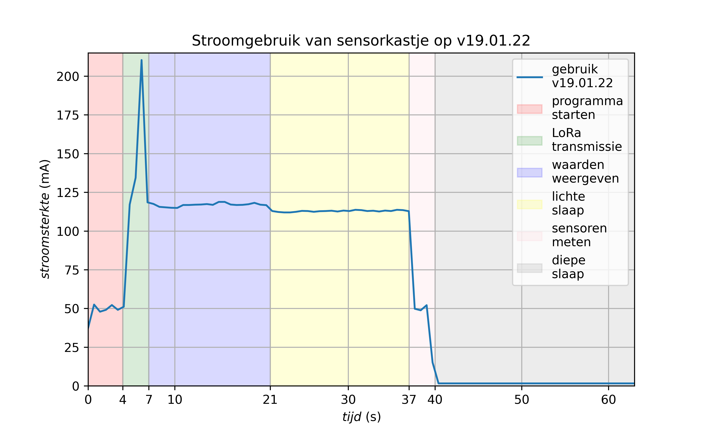
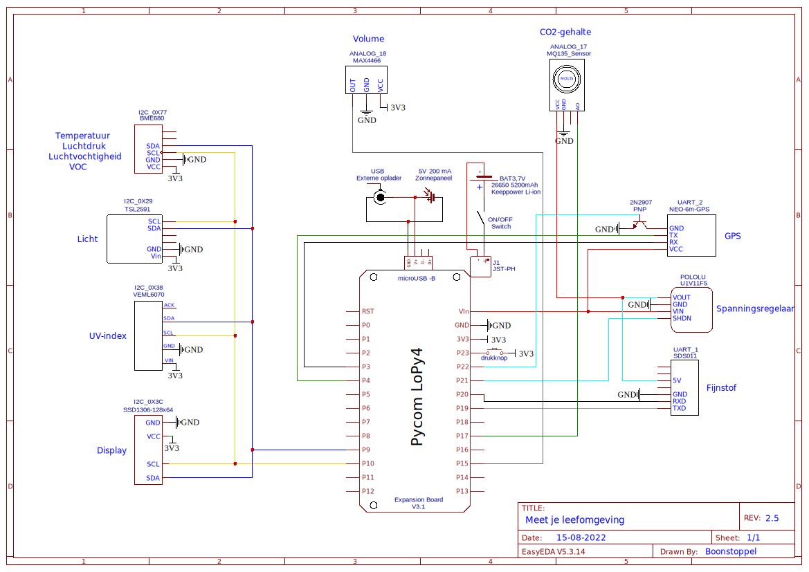

# Meet je leefomgeving
In deze repository is de meest recente software te vinden die op de meetkastjes gebruikt wordt.  
Het prototype hiervan is ontworpen door Klaas van Laveren in samenwerking met ICR3ATE en vervolgens volledig doorontwikkeld door Steven Boonstoppel.  

## Algemene opzet
De focus van de kastjes ligt uiteraard op uithoudingsvermogen. Praktisch betekent dat dat elke sensor zo kort mogelijk actief is en de stroomsterkte geminimaliseerd is.  
Met dat doel voor ogen is de volgende constructie opgezet:  
De kastjes worden zes keer per uur 'wakker' uit een diepe slaapstand. Twee keer daarvan worden alle sensoren (behalve GPS) gebruikt, dus inclusief de CO2- en fijnstofsensoren. Deze laatste twee sensoren moeten beide circa 30 seconden actief zijn om een goede meetwaarde te genereren. Om te voorkomen dat deze sensoren 'voor niets' meten, worden de berichtjes bij deze twee sessies op maximale zendkracht verzonden: SF12.  
De andere vier keer dat de kastjes wakker worden, staan ze zo kort mogelijk aan: de CO2- en fijnstofsensoren worden dus niet ingeschakeld (net als GPS). Omdat er niet altijd op SF12 verzonden mag worden (zie verderop), worden deze berichtjes verzonden op SF10. Het is mooi meegenomen als deze berichtjes aankomen, maar niet al te erg als dat niet gebeurt.  
Eén keer per dag wordt de GPS-module geactiveerd. De kastjes zullen nauwelijks verplaatsen, dus is één keer per dag afdoende. Soms is het GPS-bereik echter vrij slecht vanwege obstakels, dus wordt er een timeout gebruikt van 120 seconden: wordt er binnen die tijd geen locatie gevonden, schakelt GPS weer uit.

Zodra een meetcycles voltooid is toont het kastje eerst de gemeten waarden op het display waarbij gebruik gemaakt wordt van een *lightsleep* met verminderd stroomverbruik; daarna gaat het kastje in *deepsleep* waarbij nagenoeg alle componenten uitgeschakeld zijn: alleen de drukknop aan de zijkant van het kastje wordt nog gemonitord. Wordt die knop ingedrukt, dan wordt er een geforceerde meting op SF12 uitgevoerd. Dit helpt bijvoorbeeld bij het debuggen of testen van bereik, of bij bepaalde opdrachten waarbij leerlingen vaker een meting zouden willen doen dan het standaard-interval van 10 minuten.

## LoRa, The Things Network en Cayenne Low Power Payload
De data van de kastjes wordt verzonden via het LoRa (Long Range) protocol. De kastjes fungeren als *end node* en communiceren met de antennes bovenop het Ichthus College en eventuele andere antennes in de omgeving (Scherpenzeel, Aalst, ..). Daarvoor kan gebruik gemaakt worden van verschillende data-rates met hun eigen voordelen.  
De antennes en daarmee de kastjes zijn aangesloten op het The Things Network (TTN). Deze ondersteunt standaard SF7 t/m SF12 (respectievelijk data rates 5 t/m 0). Hoe lager de data rate, hoe groter het bereik. SF7 en SF8 zijn gelimiteerd tot 235 bytes, SF9 tot 128 bytes, en SF10 t/m SF12 tot 51 bytes. Helaas is het niet toegestaan om hardcoded alleen gebruik te maken van SF11 en/of SF12; apparaten die dit gebruik worden pro-actief geblokkeerd. Hoe hoger de Spreading Factor, hoe groter het bereik en hoe meer airtime en stroom het kost om de berichten te versturen. [Achtergrondinformatie](https://www.thethingsnetwork.org/forum/t/fair-use-policy-explained/1300).  
Voor het versturen van de LoRa berichten wordt gebruik gemaakt van CayenneLPP. Deze library ondersteunt op een compacte en efficiënte manier een aantal datatypen en geeft via myDevices een mooie webcompanion (webhook integratie nodig op TTN) waar alle data in figuren uit te lezen is met 30 dagen dataretention. In de huidige configuratie is de payload size van de CayenneLPP berichten 30, 41 of 42 bytes afhankelijk van de actieve componenten. Zodoende is gekozen om SF10 en SF12 te gebruiken.

## Hardware
Microcontroller: [Pycom LoPy4](https://pycom.io/product/lopy4/) op [Expansion Board v3(.1)](https://pycom.io/product/expansion-board-3-0/)  
Accu: [Keeppower Li-ion 26650 5200 mAh](https://www.keeppower.com.cn/products_detail.php?id=481)  
[LoRa antenne](https://www.antratek.nl/lora-antenna-kit?SID=afm3oiikld84flf5jkrgt1p1m7)  
[SSD1306](https://nl.aliexpress.com/item/32896971385.html?spm=a2g0o.productlist.0.0.52524abb6baLoT&algo_pvid=5b69281b-2a48-4f4a-8713-6caac2c8ef4f&algo_exp_id=5b69281b-2a48-4f4a-8713-6caac2c8ef4f-0&pdp_ext_f=%7B%22sku_id%22%3A%2210000001875162581%22%7D&pdp_pi=-1%3B1.86%3B-1%3BEUR+0.94%40salePrice%3BEUR%3Bsearch-mainSearch) OLED display (4-pin I2C variant!)  
[VEML6070](https://www.adafruit.com/product/2899) UV sensor  
[TSL2591](https://www.adafruit.com/product/1980) Lux sensor (andere uitvoering)  
[BME680](https://www.adafruit.com/product/3660) Temperatuur/luchtvochtigheid/luchtdruk sensor (andere uitvoering)  
[MAX4466](https://www.tinytronics.nl/shop/nl/sensoren/geluid/max4466-microfoon-versterker-module-met-microfoon) Volume sensor  
[MQ135](https://www.tinytronics.nl/shop/nl/sensoren/lucht/gas/mq-135-gas-sensor-module) CO2 sensor  
[SDS011](https://www.tinytronics.nl/shop/nl/sensoren/lucht/stof/nova-sds011-hoge-precisie-laser-stofsensor) Fijnstof sensor  
[Neo-6M](https://www.tinytronics.nl/shop/nl/communicatie-en-signalen/draadloos/gps/modules/gy-neo6mv2-gps-module) GPS module  

## LoPy4
[Pinout](https://docs.pycom.io/datasheets/development/lopy4/)  
[Micropython for LoPy4 documentation](https://docs.pycom.io/firmwareapi/)  

## Expansion Board v3.1
Let op: versie 3.1 van dit breakout board verschilt op meer vlakken van v3.0 dan de fabrikant beweert. Daarnaast is het stroomverbruik zeer slecht gedocumenteerd in verschillende modi. Gebruik dan ook de tweede link hieronder voor een zorgvuldige en complete analyse van de verschillende versies van het Expansion Board.  
[Specs: definitely a lie](https://docs.pycom.io/datasheets/expansionboards/expansion3/)  
[Specs: much better](https://gitlab.com/rcolistete/micropython-samples/-/blob/master/Pycom/Using_Expansion_Board_en.md)  
[Voltage divider: mess](https://community.hiveeyes.org/t/batterieuberwachung-voltage-divider-und-attenuation-fur-micropython-firmware/2128/46?page=2)  

## Stroomgebruik en spanning
***Verouderd: v2.0 i.t.t. huidige v2.5***  
Zie de figuur hieronder voor het stroomgebruik van de vorige versie software. De gemiddelde stroomsterkte tijdens activiteit is 105 mA; in deepsleep 3.4 mA.  
De vermoedde accuduur is drie weken, waarbij het zonnepaneel buiten beschouwing wordt gelaten.  

## Schema
Zie de figuur voor de opbouw van het circuit in de sensorkastjes.
