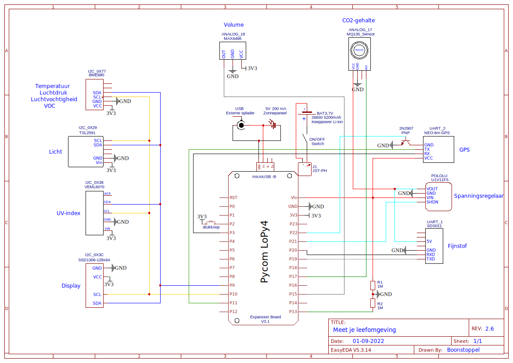

# Meet je leefomgeving
Meet je leefomgeving (MJLO) is een project van Ichthus College Veenendaal, gestart door Klaas van Lavieren en doorontwikkeld door Steven Boonstoppel. MJLO omvat 60 sensorkastjes die allerlei verschillende omgevingsfactoren meet (zoals temperatuur, luchtdruk, fijnstof e.d.).
In deze repository is de meest recente software te vinden die op de meetkastjes gebruikt wordt. Ook is het aansluitschema aanwezig en verdere informatie en instructies rondom het bouwen van een kastje.  
Bij interesse om aan te sluiten bij het project kan contact opgenomen worden via bns@ichthuscollege.nl.   
In principe is bijna alles openbaar te vinden op deze site, met uitzondering van enkele 'secrets'.  

## Een kastje flashen en activeren
Download de officiële release en flash deze op de LoPy4 door middel van de Pycom Firmware Updater (flash from local file, use LittleFS). Vervolgens moet eenmalig een aantal registers opgeslagen worden voor instellingen: daarvoor is bij releases meestal een bestand `upgrade.py` beschikbaar. Stel daarin het nummer voor de *node* in, en steek het vervolgens via een microSD in het Expansion Board. Bij juiste benaming van het bestand (secret), wordt het uitgevoerd. Verder is er nog een bestand `secret.py` dat hier niet te vinden is en noodzakelijke sleutels bevat voor activatie van het kastje.

## Algemene opzet
De focus van de kastjes ligt uiteraard op uithoudingsvermogen. Praktisch betekent dat dat elke sensor zo kort mogelijk actief is en de stroomsterkte geminimaliseerd is.  
Met dat doel voor ogen is de volgende constructie opgezet:  
De kastjes worden zes keer per uur 'wakker' uit een diepe slaapstand. Twee keer daarvan worden alle sensoren (behalve GPS) gebruikt, dus inclusief de CO2- en fijnstofsensoren. Deze laatste twee sensoren moeten beide circa 30 seconden actief zijn om een goede meetwaarde te genereren. Om te voorkomen dat deze sensoren 'voor niets' meten, worden de berichtjes bij deze twee sessies op maximale zendkracht verzonden: SF12.  
De andere vier keer dat de kastjes wakker worden, staan ze zo kort mogelijk aan: de CO2- en fijnstofsensoren worden dus niet ingeschakeld (net als GPS). Omdat er niet altijd op SF12 verzonden mag worden (zie verderop), worden deze berichtjes verzonden op SF10. Het is mooi meegenomen als deze berichtjes aankomen, maar niet al te erg als dat niet gebeurt.  
Eén keer per dag wordt de GPS-module geactiveerd. De kastjes zullen nauwelijks verplaatsen, dus is één keer per dag afdoende. Soms is het GPS-bereik echter vrij slecht vanwege obstakels, dus wordt er een timeout gebruikt van 120 seconden: wordt er binnen die tijd geen locatie gevonden, schakelt GPS weer uit.

Zodra een meetcyclus voltooid is toont het kastje eerst de gemeten waarden op het display waarbij gebruik gemaakt wordt van een *lightsleep* met verminderd stroomverbruik; daarna gaat het kastje in *deepsleep* waarbij nagenoeg alle componenten uitgeschakeld zijn: alleen de drukknop aan de zijkant van het kastje wordt nog gemonitord. Wordt die knop ingedrukt, dan wordt er een geforceerde meting op SF12 uitgevoerd. Dit helpt bijvoorbeeld bij het debuggen of testen van bereik, of bij bepaalde opdrachten waarbij leerlingen vaker een meting zouden willen doen dan het standaard-interval van 10 minuten.

## LoRa, The Things Network en Cayenne Low Power Payload
De data van de kastjes wordt verzonden via het LoRa (Long Range) protocol. De kastjes fungeren als *end node* en communiceren met de antennes bovenop het Ichthus College en eventuele andere antennes in de omgeving (Scherpenzeel, Aalst, ..). Daarvoor kan gebruik gemaakt worden van verschillende data-rates met elk hun eigen voordelen.  
De antennes en daarmee de kastjes zijn aangesloten op het The Things Network (TTN). Deze ondersteunt standaard SF7 t/m SF12 (respectievelijk data rates 5 t/m 0). Hoe lager de data rate, hoe groter het bereik. SF7 en SF8 zijn gelimiteerd tot 235 bytes, SF9 tot 128 bytes, en SF10 t/m SF12 tot 51 bytes. Helaas is het niet toegestaan om hardcoded alleen gebruik te maken van SF11 en/of SF12; apparaten die dit gebruik worden pro-actief geblokkeerd. Hoe hoger de Spreading Factor, hoe groter het bereik en hoe meer airtime en stroom het kost om de berichten te versturen. [Achtergrondinformatie](https://www.thethingsnetwork.org/forum/t/fair-use-policy-explained/1300).  
Voor het versturen van de LoRa berichten wordt gebruik gemaakt van een eigen decoder. De waarden worden verpakt in *integers* met een bepaalde precisie en gecodeerd tot kale bytes. Vervolgens draait op TTN een decoder die op dezelfde wijze de getallen terugberekend. In de huidige configuratie is het formaat van de berichten 16, 22 of 25 bytes afhankelijk van de actieve componenten. Een website waarop alle waarden uit te lezen zijn inclusief grafiekjes is een work-in-progress.

## Hardware
Microcontroller: [Pycom LoPy4](https://pycom.io/product/lopy4/) op [Expansion Board v3(.1)](https://pycom.io/product/expansion-board-3-0/)  
Accu: [Keeppower Li-ion 26650 5200 mAh](https://www.keeppower.com.cn/products_detail.php?id=481)  
[LoRa antenne](https://www.antratek.nl/lora-antenna-kit?SID=afm3oiikld84flf5jkrgt1p1m7)  
[SSD1306](https://nl.aliexpress.com/item/32896971385.html?spm=a2g0o.productlist.0.0.52524abb6baLoT&algo_pvid=5b69281b-2a48-4f4a-8713-6caac2c8ef4f&algo_exp_id=5b69281b-2a48-4f4a-8713-6caac2c8ef4f-0&pdp_ext_f=%7B%22sku_id%22%3A%2210000001875162581%22%7D&pdp_pi=-1%3B1.86%3B-1%3BEUR+0.94%40salePrice%3BEUR%3Bsearch-mainSearch) OLED display (4-pin I2C variant!)  
[VEML6070](https://www.adafruit.com/product/2899) UV sensor  
[TSL2591](https://www.adafruit.com/product/1980) Lux sensor (andere uitvoering)  
[BME680](https://www.adafruit.com/product/3660) Temperatuur/luchtvochtigheid/luchtdruk sensor (andere uitvoering)  
[MAX4466](https://www.tinytronics.nl/shop/nl/sensoren/geluid/max4466-microfoon-versterker-module-met-microfoon) Volume sensor  
[MQ135](https://www.tinytronics.nl/shop/nl/sensoren/lucht/gas/mq-135-gas-sensor-module) CO2 sensor  
[SDS011](https://www.tinytronics.nl/shop/nl/sensoren/lucht/stof/nova-sds011-hoge-precisie-laser-stofsensor) Fijnstof sensor  
[Neo-6M](https://www.tinytronics.nl/shop/nl/communicatie-en-signalen/draadloos/gps/modules/gy-neo6mv2-gps-module) GPS module  

## LoPy4
[Pinout](https://docs.pycom.io/datasheets/development/lopy4/)  
[Micropython for LoPy4 documentation](https://docs.pycom.io/firmwareapi/)  

## Expansion Board v3.1
Let op: versie 3.1 van dit breakout board verschilt op meer vlakken van v3.0 dan de fabrikant beweert. Daarnaast is het stroomverbruik zeer slecht gedocumenteerd in verschillende modi. Gebruik dan ook de tweede link hieronder voor een zorgvuldige en complete analyse van de verschillende versies van het Expansion Board.  
[Specs: definitely a lie](https://docs.pycom.io/datasheets/expansionboards/expansion3/)  
[Specs: much better](https://gitlab.com/rcolistete/micropython-samples/-/blob/master/Pycom/Using_Expansion_Board_en.md)  
[Voltage divider: mess](https://community.hiveeyes.org/t/batterieuberwachung-voltage-divider-und-attenuation-fur-micropython-firmware/2128/46?page=2)  

## Stroomgebruik en spanning
***Verouderd: v2.0 i.t.t. huidige v2.5***  
Zie de figuur hieronder voor het stroomgebruik van de vorige versie software. De gemiddelde stroomsterkte tijdens activiteit is 105 mA; in deepsleep 3.4 mA.  
De vermoedde accuduur is drie weken, waarbij het zonnepaneel buiten beschouwing wordt gelaten.  

## Schema
Zie de figuur voor de opbouw van het circuit in de sensorkastjes.

## Custom firmware
De eenvoudige variant voor het ontwikkelen van software is het uploaden van alle losse bestanden naar `/flash`. Bij het wijzigen van een bestand kan dat losse bestand snel gewijzigd en opnieuw geupload worden. Er zijn echter meerdere nadelen aan verbonden:
* Het uploaden van alle bestanden kan lang duren (ca. een minuut)
* Het is onduidelijk of alle bestanden van de nieuwste versie zijn
* OTA updates zijn niet goed uit te voeren
* Ieder willekeurig persoon kan de bestanden downloaden en de sleutels misbruiken
* Het `import`eren van bestanden na deepsleep duurt meerdere seconden
* Het aansluiten van een kastje via USB-kabel vereist meerdere pruts-handelingen

Daarom is ervoor gekozen om zelf de firmware te compilen (*Linux only!*) en daar de software bij in te vriezen; het lost alle bovenstaande problemen op (behalve dat een OTA update ook ca. een minuut duurt). Daarvoor zijn de volgende stappen nodig, verzameld van een aantal links die eronder vermeld zijn:
* `sudo apt-get install git gcc python3 make`
* `git clone --recursive -b idf_v3.3.1 https://github.com/pycom/pycom-esp-idf.git`
* `cd pycom-esp-idf`
* `nano tools/idf_tools.py` -> regel 1155: verwijder `'--no-site-packages'` optie
* `./install.sh`

De volgende twee regels moeten elke keer uitgevoerd worden bij het openen van een terminal alvorens de firmware te compilen (tenzij het lukt om PATH goed in te stellen):
* `. ./export.sh`
* `idf.py build`
* `cd ..`
* `git clone --recursive https://github.com/pycom/pycom-micropython-sigfox.git`
* `cd pycom-micropython-sigfox`
* `cd mpy-cross && make clean && make && cd ..`
* `cd esp32`
* `nano Makefile` -> regel 12: vervang `WIPY` door `LOPY4` om standaard voor de LoPy4 te compilen

(De volgende opmerkingen gaan er allemaal vanuit dat je je in de map `pycom-micropython-sigfox/esp32` bevindt.)

Om bestanden in te vriezen, moeten ze in de subfolder `/frozen/Base` geplaatst worden. Standaard staan daar een `_boot.py` en `_main.py`: die kunnen overschreven worden met de desbetreffende bestanden uit deze repository zonder verlies van functionaliteit.  
Om relatieve imports te behouden (bijvoorbeeld `import lib.SSD1306`) kan de map `/lib` ook gewoon binnen de map `/frozen/Base` geplaatst worden.  
Let op: het is niet mogelijk de bestanden `boot.py` en `main.py` zelf te bevriezen: die worden standaard geleegd bij het compilen.

Om de versienaam aan te passen:
* `nano pycom_version.h` -> regel 13: aanpassen

Om aan te passen welk bestand er uitgevoerd wordt na `_boot.py` en `_main.py` (in dit geval `"error.py"` in `/frozen/Base`):
* `nano mptask.c` -> regel 339: vervang `pyexec_file(main.py)` door `pyexec_frozen_module("error.py")`

De volgende regels zijn (elke keer) nodig om de firmware te compilen:
* `make clean`
* `make`
* `make release`

Het resulterende `.tar.gz` bestand staat in de subfolder `/build`. Dit bestand kan gebruikt worden om de LoPy4 te flashen via de Pycom Firmware Updater. Om het `.bin` bestand te verkrijgen dat nodig is voor de OTA updates, moet de `.tar.gz` uitgepakt worden via bijvoorbeeld `tar -xzf filename`: het resulterende `lopy4.bin` is het gezochte bestand.