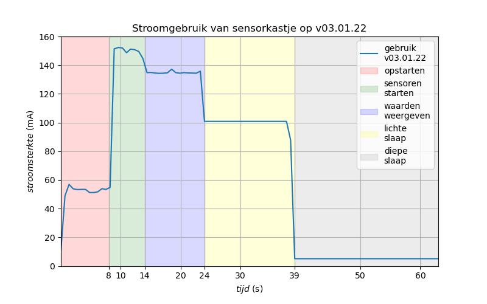

# Meet je leefomgeving
In deze repository vindt u de meest recente software die op de meetkastjes gebruikt wordt.  
Het prototype hiervan is aangeleverd door ICR3ATE en vervolgens volledig verder ontwikkeld door Steven Boonstoppel.  

## Algemene opzet
De constructie van de software is als volgt:  
Bij het opstarten wordt <kbd>boot.py</kbd> uitgevoerd. Als allereerste wordt daar de LED en WiFi onderdrukt. Vervolgens starten direct de SDS011 en MQ135 die beiden 30 seconden tijd nodig hebben om hun metingen te stabiliseren. Omdat UART naar de SDS011 op minder dan de officiële 5V traag start, wordt er gewacht tot er een respons is gekomen.  
Daarna wordt <kbd>main.py</kbd> uitgevoerd. Hierin start het kastje met het initialiseren van het display en vervolgens wordt er gepoogd de LoRa informatie te herstellen vanuit RAM. Is er niets aanwezig in RAM (en is LoRa dus nog niet gejoind), dan joint hij het netwerk; anders kan hij direct door vanuit de deepsleep reset. Daarna wordt gezocht of er vanuit de vorige sessie sensorwaarden zijn opgeslagen in RAM. Als dat het geval is, worden deze nu verzonden over LoRa en op het display getoond. Vervolgens worden alle anderen sensoren gestart en worden hun relevante waarden gemeten, waarna ze weer in slaapstand gezet worden. Daarna wordt de LoRa informatie weer opgeslagen in RAM en in lightsleep gewacht tot de 30 seconden opwarmtijd voorbij zijn (er zijn circa 15 seconden resterend, afhankelijk van de instellingen). Dan worden de laatste twee sensoren gemeten en alle waarden opgeslagen in RAM, om vervolgens in deepsleep te gaan. De waarden van deze sessie worden pas tijdens de volgende verzonden.  
Wordt tijdens deepsleep op de knop gedrukt, dan waakt het kastje op en wordt de GPS-module geactiveerd om de locatie vast te zetten. Aangezien dit slechts bij verplaatsing hoeft te gebeuren, wordt dit ook maar eenmalig uitgevoerd. Zodra een GPS-fix is gevonden, wordt de module weer gedeactiveerd.  

## LoRa, The Things Network en Cayenne Low Power Payload
De data van de kastjes wordt verzonden via het LoRa (Long Range) protocol. De kastjes fungren als *end node*  en communiceren met de antennes bovenop de Veense middelbare scholen (en eventueel andere actieve binnen het bereik). Daarvoor kan gebruikt maken van verschillende data-rates met hun eigen voordelen.  
De antennes en daarmee de kastjes zijn aangesloten op het The Things Network (TTN). Deze ondersteunt standaard SF9 of SF12 (respectievelijk data rates 3 en 0). Hoe lager de data rate, hoe groter het bereik. SF7 en SF8 zijn gelimiteerd tot 235 bytes, SF9 tot 128 bytes, en SF10 t/m SF12 tot 51 bytes. Helaas is het niet toegestaan om hardcoded alleen gebruik te maken van SF11 en/of SF12; apparaten die dit gebruik worden pro-actief geblokkeerd. Hoe hoger de Spreading Factor, hoe groter het bereik en hoe meer airtime en stroom het kost om de berichten te versturen. [Achtergrondinformatie](https://www.thethingsnetwork.org/forum/t/fair-use-policy-explained/1300).  
Voor het versturen van de LoRa berichten wordt gebruik gemaakt van CayenneLPP. Deze library ondersteunt op een compacte en efficiënte manier een aantal datatypen en geeft via myDevices een mooie webcompanion (webhook integratie nodig op TTN) waar alle data in figuren uit te lezen is met 30 dagen dataretention. In de huidige configuratie is de payload size van de CayenneLPP berichten 54 bytes (12 channel bytes, 12 sensortype bytes en 30 databytes). Dit maakt het gebruik van SF10 en hoger onmogelijk, dus houden we voor nu SF9 aan. Mogelijkheden om te verhogen naar SF10 en misschien SF11 of SF12 worden onderzocht, vanwege slechts incidentele GPS-fixes die wel 11 van de 54 bytes kosten.

## Hardware
Microcontroller: [Pycom LoPy4](https://pycom.io/product/lopy4/) op [Expansion Board v3(.1)](https://pycom.io/product/expansion-board-3-0/)  
Accu: [Keeppower Li-ion 26650 5200 mAh](https://www.keeppower.com.cn/products_detail.php?id=481)  
[LoRa antenne](https://www.antratek.nl/lora-antenna-kit?SID=afm3oiikld84flf5jkrgt1p1m7)  
[SSD1306](https://nl.aliexpress.com/item/32896971385.html?spm=a2g0o.productlist.0.0.52524abb6baLoT&algo_pvid=5b69281b-2a48-4f4a-8713-6caac2c8ef4f&algo_exp_id=5b69281b-2a48-4f4a-8713-6caac2c8ef4f-0&pdp_ext_f=%7B%22sku_id%22%3A%2210000001875162581%22%7D&pdp_pi=-1%3B1.86%3B-1%3BEUR+0.94%40salePrice%3BEUR%3Bsearch-mainSearch) OLED display (4-pin I2C variant!)  
[VEML6070](https://www.adafruit.com/product/2899) UV sensor  
[TSL2591](https://www.adafruit.com/product/1980) Lux sensor (andere uitvoering)  
[BME680](https://www.adafruit.com/product/3660) Temperatuur/luchtvochtigheid/luchtdruk sensor (andere uitvoering)  
[MAX4466](https://www.tinytronics.nl/shop/nl/sensoren/geluid/max4466-microfoon-versterker-module-met-microfoon) Volume sensor  
[MQ135](https://www.tinytronics.nl/shop/nl/sensoren/lucht/gas/mq-135-gas-sensor-module) CO2 sensor  
[SDS011](https://www.tinytronics.nl/shop/nl/sensoren/lucht/stof/nova-sds011-hoge-precisie-laser-stofsensor) Fijnstof sensor  
[Neo-6M](https://www.tinytronics.nl/shop/nl/communicatie-en-signalen/draadloos/gps/modules/gy-neo6mv2-gps-module) GPS module  

## LoPy4
[Pinout](https://docs.pycom.io/datasheets/development/lopy4/)  
[Micropython for LoPy4 documentation](https://docs.pycom.io/firmwareapi/)  

## Expansion Board v3.1
Let op: versie 3.1 van dit breakout board verschilt op meer vlakken van v3.0 dan de fabrikant beweert. Daarnaast is het stroomverbruik zeer slecht gedocumenteerd in verschillende modi. Gebruik dan ook de tweede link hieronder voor een zorgvuldige en complete analyse van de verschillende versies van het Expansion Board.  
[Specs: definitely a lie](https://docs.pycom.io/datasheets/expansionboards/expansion3/)  
[Specs: much better](https://gitlab.com/rcolistete/micropython-samples/-/blob/master/Pycom/Using_Expansion_Board_en.md)  
[Voltage divider: mess](https://community.hiveeyes.org/t/batterieuberwachung-voltage-divider-und-attenuation-fur-micropython-firmware/2128/46?page=2)  

## Stroomgebruik en spanning
Zie de figuur hieronder voor het stroomgebruik van de huidige versie software. De gemiddelde stroomsterkte tijdens activiteit is 105 mA; in slaap 5.1 mA.  
De SDS011 gebruikt tijdens slaap 2.8 mA, de BME680 0.6 mA, de MAX4466 0.3 mA; het restant (1.4 mA) kan waarschijnlijk toegeschreven worden aan de LoPy4 + Expansion Board.  
De SDS011 hoort officieel op 5V te draaien. Vanwege de (in)efficiëntie van boost converters van accuspanning naar 5V draait deze sensor echter op een officieel te laag voltage. Kwalitatieve tests moeten nog gedaan worden, maar eerst test doet vermoeden dat meetresultaten niet beïnvloed worden; de sensor start alleen een enkele seconde slomer op. Wel zorg dus om de kastjes op tijd op te laden, want de ventilator draait wel erg traag in de dip van de ontladingscyclus van een lithium accu.  

## Schema
Zie [dit bestand](Meet-je-leefomgeving-schematic.pdf) voor de opbouw van het circuit in de sensorkastjes.

## Libraries
De libraries in deze repository zijn overgenomen van bestaande Circuit- of MicroPython en vervolgens zo ver als mogelijk gestript om de import-tijden beperkt te houden. CircuitPython libraries zijn waar nodig omgebouwd om met MicroPython te kunnen gebruiken.  
[SSD1306 MicroPython](https://github.com/adafruit/micropython-adafruit-ssd1306/blob/master/ssd1306.py)  
[VEML6070 CircuitPython](https://github.com/adafruit/Adafruit_CircuitPython_VEML6070/blob/main/adafruit_veml6070.py)  
[TSL2591 CircuitPython](https://github.com/adafruit/Adafruit_CircuitPython_TSL2591/blob/main/adafruit_tsl2591.py)  
[BME680 CircuitPython](https://github.com/adafruit/Adafruit_CircuitPython_BME680/blob/main/adafruit_bme680.py)  
[MQ135 MicroPython](https://github.com/rubfi/MQ135/blob/master/mq135.py)  
[SDS011 MicroPython](https://github.com/alexmrqt/micropython-sds011/blob/master/sds011.py)  
[GPS decoder MicroPython](https://github.com/inmcm/micropyGPS/blob/master/micropyGPS.py)